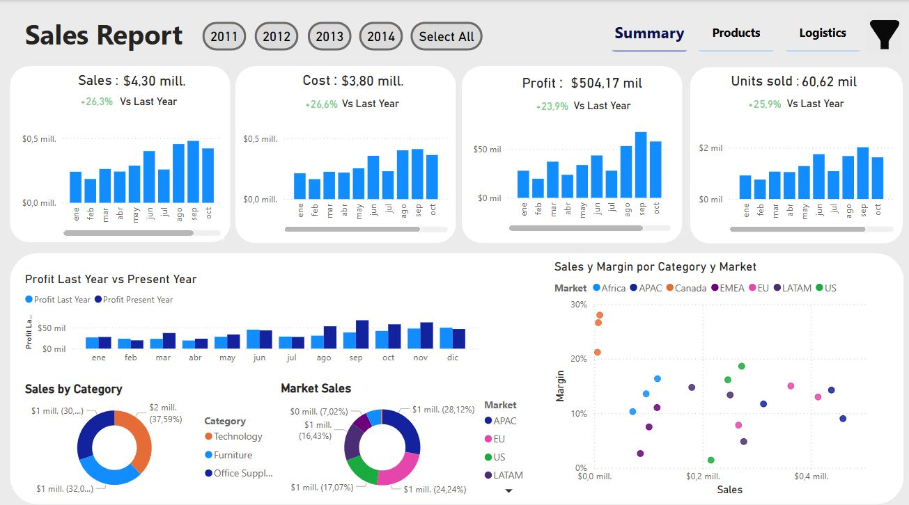

# 📊 Sales Analytics Dashboard 
 
  
*Dashboard interactivo con KPIs anuales*

🔍 **Explorar vistas detalladas**:  
[Products](outputs/Dashboard_Products.JPG) | [Logistics](outputs/Dashboard_Logistics.JPG) | [Filtros](outputs/Dashboard_filtering.JPG)

## 🎯 Objetivo
Análisis interactivo de ventas y rentabilidad (2012-2015) para:
- Identificar mercados y categorías más rentables
- Detectar oportunidades de mejora (ej: pérdidas en "Tables")

## 🔧 Herramientas
| Tecnología | Uso |
|------------|-----|
| Power BI | Visualización y modelado |
| DAX | Métricas avanzadas (`Margin`, `Profit Growth`) |
| Power Query | Limpieza de datos |

## 💡 Insights Clave
- 📈 **Crecimiento**: +23.9% beneficios en 2014 vs 2013
- 🌎 **Top mercado**: APAC ($1.2M ventas / $140K beneficio)
- ⚠️ **Alerta**: Subcategoría *"Tables"* con pérdidas del 12.5%
- 🏆 **Mejor producto**: *"Copiers"* (18.9% margen)

## 🖥️ Cómo Explorar el Proyecto
1. Descargar [`SalesReport.pbix`](powerbi/)
2. Ver [methodology.md](/docs/) para detalles de DAX y ETL
3. Explorar [video demo](/outputs/demo.mp4)
